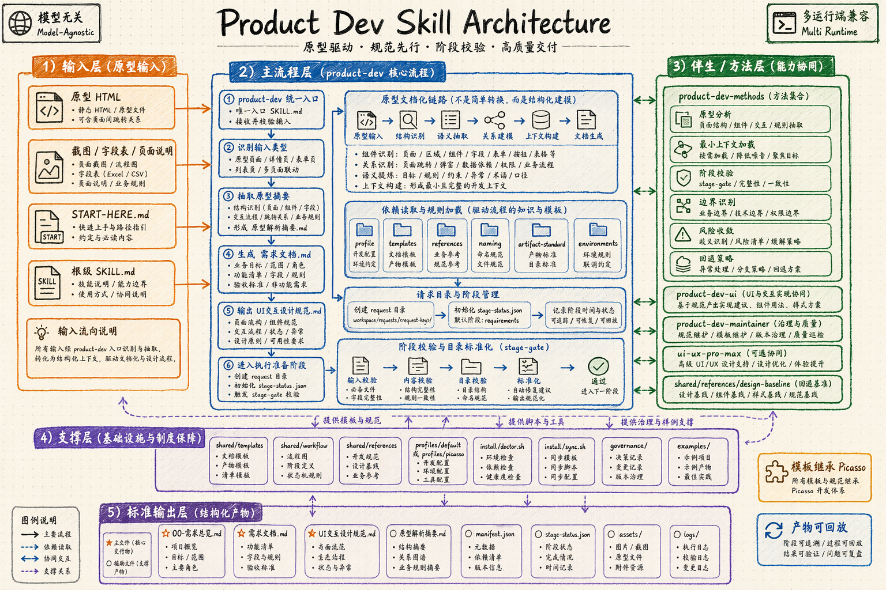

# Product Dev Skill

---

<div align="center">
  <strong>独立设计的产品经理原型交付技能包 · 原型 HTML 直出需求文档与 UI 交互文档 · 模型无关 · 多运行端兼容</strong>
  <br>
  <br>
  <p>面向产品组的轻量技能包，专门把“原型页面 -> 需求文档 -> UI交互文档”收敛成一套可复制、可陪跑、可质检的标准流程</p>
  <p>适合团队在 Claude、Codex、OpenClaw、OpenCode 或其他可识别本地 skill 的模型环境中直接复用</p>
</div>

---

第一次接手这个仓库，先看 [START-HERE.md](/Users/qierkang/.codex/codex-workspace/product-dev-skill/START-HERE.md)。

## 🗺️ 架构图

这张图把 `product-dev-skill` 的输入层、主流程层、伴生 skill、支撑层和标准输出层放在一张图里，适合先看整体链路。



## 项目概述

`product-dev-skill` 是一套独立设计的产品原型交付技能包，面向原型文档化场景提供统一的输入、规则和产物链路。

它不负责开发、联调、测试和发布，专门负责两件事：

1. 读取原型 HTML、截图、字段表和页面说明，沉淀成结构化 `需求文档.md`
2. 在需求文档基础上继续产出 `UI交互设计规范.md`

核心目标不是“写一份看起来像文档的文档”，而是让 4 到 8 个产品经理在不同机器、不同模型、不同运行端下，都能稳定跑出同一口径的文档基线。

## 核心特色

- **统一入口**：所有原型文档化任务统一从 `product-dev` 进入
- **双主产物**：固定产出 `需求文档.md` 与 `UI交互设计规范.md`
- **统一文档约束**：需求文档模板采用稳定的强约束结构，保证字段、边界、验收口径一致
- **设计协同可插拔**：运行端如果已安装 `ui-ux-pro-max`，UI 阶段优先借助它补设计基线；未安装时自动回退到仓库内置设计规则
- **Harness Engineering 思路收口**：入口小、上下文显式、约束脚本化、反馈可回放
- **运行端兼容**：Claude、Codex、OpenClaw、OpenCode 均可接入
- **易复制落地**：目录、脚本、模板、Gate、示例全部在仓库内闭环

## 目录结构

```text
product-dev-skill/
├── .claude-plugin/ # Claude Code 适配层
├── .codex/         # Codex 适配层
├── .opencode/      # OpenCode 适配层
├── .openclaw/      # OpenClaw 适配层
├── SKILL.md        # 根级技能入口索引
├── install/        # 初始化、体检、同步脚本
├── skills/         # 主 skill、UI skill、方法层、维护 skill
├── profiles/       # 默认画像与配置入口说明
├── shared/         # 中文模板、参考规则、通用脚本、工作流说明
├── workspace/      # 运行中的 request 目录（默认不提交）
├── governance/     # 更新记录、决策记录、维护索引
└── examples/       # 真实模拟产物示例
```

## Skills 组成

### 统一入口

- `product-dev-skill`
  - 根级入口索引
  - 兼容只能识别仓库根 `SKILL.md` 的运行端
- `product-dev`
  - 主流程入口
  - 负责初始化 request、整理输入原型、生成需求文档、驱动 Gate

### Companion Skills

- `product-dev-ui`
  - 专门负责 UI 交互文档沉淀
- `product-dev-methods`
  - 提供原型分析、最小上下文加载、阶段校验等方法层约束
- `product-dev-maintainer`
  - 负责维护 skill 包本身时的治理记录、变更说明和示例更新

## 外部设计 skill 协同

当前推荐与 `ui-ux-pro-max` 配合使用，但不是强依赖。

规则如下：

1. 若运行端可识别 `ui-ux-pro-max`
   - 先让它输出风格方向、token、组件策略、动效、可访问性基线
   - 再回填到 `product-dev-skill` 的模板结构中
2. 若运行端不可识别 `ui-ux-pro-max`
   - 自动回退到 `shared/references/design/`
   - 继续按同一套模板输出，不中断主流程
3. 即使运行端还能识别 `frontend-design` 等通用设计 skill，也不得把它们当成默认回退路径

## 方法层与适配层

当前结构采用“主流程层 + 方法层 + 适配层”的表达方式：

- 主流程层：`skills/product-dev/`
- 方法层：`skills/product-dev-methods/`
- 适配层：`.claude-plugin/`、`.codex/`、`.opencode/`、`.openclaw/`

适配层只负责说明“各运行端如何接入这套技能包”，不复制第二套主流程。

## Harness Engineering 思路参考

本仓库按 Harness Engineering 的思路做了结构化收口，但不把术语堆成独立框架，重点落在几个可执行点上：

- **小入口**：统一从 `product-dev` 进入，不把规则散落在对话里
- **显式上下文**：模板、参考规则、profile、示例都在仓库内可读
- **脚本约束**：`init-request.py`、`extract-prototype-outline.py`、`stage-gate.py` 负责把关键动作做成可重复执行的步骤
- **反馈回路**：每次真实模拟都能回写到 `workspace/` 与 `examples/`
- **可迁移**：不写死宿主机路径，环境差异尽量收敛到 `profiles/` 与 `.env`

## 标准产物

当前主链路固定围绕 5 个文件推进：

| 文件 | 作用 |
|------|------|
| `00-需求总览.md` | request 导航、输入资产、页面清单、待确认项 |
| `需求文档.md` | 业务规则、字段设计、按钮逻辑、主子表结构 |
| `UI交互设计规范.md` | 页面分区、状态、交互路径、端差异、验收要点 |
| `manifest.json` | 机器可读 request 元信息 |
| `stage-status.json` | 当前阶段与 Gate 结果 |

可选辅助产物：

- `原型解析摘要.md`
- `assets/` 原型输入资产索引
- `logs/` 过程记录

详细模板索引见 [shared/templates/README.md](/Users/qierkang/.codex/codex-workspace/product-dev-skill/shared/templates/README.md)。

内置设计兜底参考见：

- [shared/references/design/README.md](/Users/qierkang/.codex/codex-workspace/product-dev-skill/shared/references/design/README.md)

## 快速开始

### 1. 初始化

```bash
git clone <your-git>/product-dev-skill.git
cd product-dev-skill
bash install/setup.sh
bash install/doctor.sh --capability docs
```

### 2. 初始化 request

```bash
python3 shared/scripts/init-request.py \
  --request-key project-management-demo \
  --workspace workspace/requests \
  --title "项目管理"
```

### 3. 抽取原型摘要

```bash
python3 shared/scripts/extract-prototype-outline.py \
  --request-dir workspace/requests/project-management-demo \
  --input /path/to/page-a.html \
  --input /path/to/page-b.html
```

### 4. 产出主文档

按模板补齐：

- `00-需求总览.md`
- `需求文档.md`
- `UI交互设计规范.md`

### 5. 跑 Gate

```bash
python3 shared/scripts/stage-gate.py \
  --request-dir workspace/requests/project-management-demo \
  --stage requirement

python3 shared/scripts/stage-gate.py \
  --request-dir workspace/requests/project-management-demo \
  --stage ui

python3 shared/scripts/stage-gate.py \
  --request-dir workspace/requests/project-management-demo \
  --stage all
```

## 推荐执行链路

`doctor docs -> init request -> 读取原型 -> 生成需求文档 -> requirement gate -> 生成 UI 交互文档 -> ui gate -> 沉淀 example`

## Profile 机制

通过 `profiles/default/` 管理可迁移配置：

- request 输出目录
- 默认作者
- 默认平台范围
- 当前 skill 的执行边界

第一次迁移到新机器时，优先修改：

- [profiles/default/profile.yaml](/Users/qierkang/.codex/codex-workspace/product-dev-skill/profiles/default/profile.yaml)
- [profiles/default/配置入口说明.md](/Users/qierkang/.codex/codex-workspace/product-dev-skill/profiles/default/配置入口说明.md)
- `.env`（如需要同步到本地 skill 目录）

## 示例

真实模拟样例见：

- [examples/project-management-pm-recheck](/Users/qierkang/.codex/codex-workspace/product-dev-skill/examples/project-management-pm-recheck)
