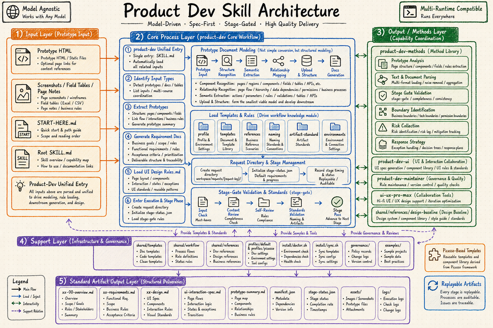

# Product Dev Skill

<!-- Keywords: product requirements skill, prototype analysis, UI interaction specification, Claude Code skill, Codex skill, HTML prototype to PRD -->

<div align="center">
  
</div>

<div align="center">
  <strong>Turn HTML prototypes, screenshots, field tables, and page notes into structured requirements and UI interaction specifications</strong>
  <br><br>
  <em>Shared inputs, templates, stage state, and gates keep product documentation consistent across people and AI runtimes.</em>
  <br><br>
  <code>SKILL.md</code> · Prototype Analysis · Requirements · UI Spec · Stage Gate
  <br><br>
  From prototype input to development-ready, reviewable product documentation.
  <br><br>
  If this saves product-analysis time, consider starring it after the public release.
</div>

<div align="center">
  <a href="#quick-start">Quick Start</a> ·
  <a href="../README.md">简体中文</a> ·
  <a href="#workflow-overview">Workflow</a> ·
  <a href="#system-architecture">Architecture</a> ·
  <a href="#faq">FAQ</a>
</div>

<div align="center">


[](https://github.com/qierkang/product-dev-skill/actions/workflows/ci.yml)
[](https://github.com/qierkang/product-dev-skill/stargazers)

</div>

---



---

## Why Product Dev Skill?

- Prototypes show visual results while omitting fields, permissions, rules, exceptions, and write-back behavior.
- Different prompts and runtimes produce inconsistent requirement depth and structure.
- Parent, child, and grandchild table relationships are easily flattened or lost.
- UI documents without states, boundaries, and acceptance conditions still force developers to guess.
- Without stage state and gates, a document can look complete while critical gaps remain.

**Product Dev Skill turns prototype analysis, requirement modeling, UI specifications, and stage validation into one minimal but complete delivery chain.**

```text
Use product-dev to turn these HTML prototypes into requirements and a UI interaction specification.
```

| Ad-hoc documentation | This project |
|---|---|
| Describe screenshots one by one | Identify pages, components, fields, relationships, and rules |
| Structure changes by author | Use stable templates and naming |
| Requirements and UI drift apart | Advance both artifacts in one request state |
| Completion is subjective | Run requirement, UI, and all gates |
| Results are hard to replay | Keep manifest, stage state, and logs |

## Project Overview

Product Dev Skill is a self-contained prototype documentation package. It reads HTML prototypes, screenshots, field tables, and page notes; produces a structured requirements document; produces a UI interaction specification; and validates required artifacts for completeness and consistency. It intentionally stops before coding, integration, QA, and release.

> Product Dev Skill turns prototypes into structured requirements and UI interaction specifications with repeatable templates and stage gates.
>
> If this saves you time, a ⭐ helps others find it.

## Core Features

- **Prototype modeling** identifies pages, regions, components, fields, actions, tables, and business relationships.
- **Two primary artifacts** standardize `requirements.md` and `ui-interaction-spec.md`.
- **Strong templates** preserve hierarchical data, boundaries, states, and acceptance rules.
- **Stage gates** validate requirement, UI, and complete request states.
- **Optional design collaboration** uses `ui-ux-pro-max` when available and internal design rules otherwise.

## Comparison

| Approach | Prototype analysis | Structured requirements | UI interaction spec | Stage gates | Replayable |
|---|---:|---:|---:|---:|---:|
| **Product Dev Skill** | ✅ | ✅ | ✅ | ✅ | ✅ |
| Generic documentation prompt | Partial | Unstable | Partial | ❌ | ❌ |
| Prototype export tool | ✅ | Visual-first | Partial | ❌ | Partial |
| Full engineering workflow skill | ✅ | ✅ | ✅ | ✅ | ✅, but heavier |

## Workflow Overview

| Stage | Action | Output |
|---|---|---|
| Environment | `doctor.sh --capability docs` | Runnable environment |
| Request init | `init-request.py` | Directory, manifest, stage state |
| Prototype extraction | `extract-prototype-outline.py` | Prototype summary |
| Requirement modeling | Add business, fields, rules, boundaries | Requirements document |
| Requirement Gate | Check completeness and rules | Pass/fail |
| UI specification | Add layout, components, states, interactions | UI interaction spec |
| UI / All Gate | Check consistency and final artifacts | Deliverable request |

Run doctor and start from `product-dev` when the next step is unclear.

## Quick Start

### Prerequisites

- Python 3.
- A runtime that can read `SKILL.md`.
- At least one prototype input: HTML, screenshot, field table, or page notes.

```bash
git clone https://github.com/qierkang/product-dev-skill.git
cd product-dev-skill
bash install/setup.sh
bash install/doctor.sh --capability docs
```

```bash
python3 shared/scripts/init-request.py \
  --request-key project-management-demo \
  --workspace workspace/requests \
  --title "Project Management"

python3 shared/scripts/extract-prototype-outline.py \
  --request-dir workspace/requests/project-management-demo \
  --input /path/to/page-a.html \
  --input /path/to/page-b.html
```

<details>
<summary>Standard artifacts</summary>

```text
workspace/requests/<request-key>/
├── 00-requirements-overview.md
├── requirements.md
├── ui-interaction-spec.md
├── prototype-summary.md
├── manifest.json
├── stage-status.json
├── assets/
└── logs/
```

</details>

## Modules

### `product-dev`

- Initializes request directories and machine-readable state.
- Detects prototype inputs and loads templates, rules, and profiles.
- Organizes requirement generation and the requirement gate.

### `product-dev-ui`

- Maps requirements to pages, components, states, and interactions.
- Documents empty, loading, error, and permission states.
- Produces an implementation and UI-acceptance reference.

### `product-dev-methods`

- Provides prototype analysis, minimal context loading, and self-review methods.
- Preserves business, technical, and permission boundaries.
- Records risks, exception handling, and fallback strategies.

### `product-dev-maintainer`

- Maintains templates, rules, scripts, versions, and governance.
- Keeps examples aligned with gates.
- Owns multi-runtime adapter documentation.

## Technology Stack

| Layer | Technology or asset | Purpose |
|---|---|---|
| Skill entry | `SKILL.md` | Main and companion routing |
| Prototype parsing | Python | Structure, semantics, relationships |
| Document templates | Markdown | Requirements and UI baselines |
| State | JSON | Manifest and stage status |
| Gates | `stage-gate.py` | Completeness, consistency, naming |
| Configuration | YAML / `.env` | Portable profile differences |
| Visuals | `image_gen` | README architecture and branding |

## System Architecture

### Workflow Design

```text
Prototype HTML / screenshots / field tables
  -> product-dev
     -> identify pages, components, fields, relations, rules
     -> initialize request + stage state
     -> requirements document -> requirement gate
     -> UI interaction specification -> UI gate
     -> all gate -> replayable example
  -> product-dev-methods / product-dev-ui / maintainer
```

### Architecture Notes

- The main workflow stops at requirements and UI documentation.
- Templates, rules, and examples live in the repository to prevent runtime-specific prompt drift.
- Runtime requests stay under `workspace/`; only validated and sanitized examples move into `examples/`.


## Directory Structure

```text
├── SKILL.md
├── skills/{product-dev,product-dev-ui,product-dev-methods,product-dev-maintainer}/
├── profiles/default/
├── shared/{templates,references,workflow,scripts}/
├── install/
├── examples/
├── governance/
├── assets/
├── docs/
└── workspace/requests/
```

## Command Reference

| Command | Purpose |
|---|---|
| `bash install/setup.sh` | Initialize directories |
| `bash install/doctor.sh --capability docs` | Validate documentation capability |
| `python3 shared/scripts/init-request.py ...` | Create a request |
| `python3 shared/scripts/extract-prototype-outline.py ...` | Extract prototype structure |
| `python3 shared/scripts/stage-gate.py --request-dir <dir> --stage requirement` | Validate requirements |
| `python3 shared/scripts/stage-gate.py --request-dir <dir> --stage ui` | Validate UI documentation |
| `python3 shared/scripts/stage-gate.py --request-dir <dir> --stage all` | Validate the complete request |

## Development Guide

### Template changes

Use `shared/templates/需求文档模板.md` as the baseline and update examples and gates together.

### Prototype parsing

The parser creates a structured summary but must not invent business rules. Unknowns belong in the confirmation list.

### Safety boundaries

- Never commit real customer prototypes, screenshots, or runtime logs.
- Never hardcode personal host paths in documentation or scripts.
- Never flatten parent, child, and grandchild relationships into one field list.

## Development and Validation

```bash
bash install/doctor.sh --capability docs
python3 shared/scripts/stage-gate.py \
  --request-dir examples/project-management-pm-recheck \
  --stage all
python3 scripts/readme-gate.py --readme README.md
python3 scripts/readme-gate.py --readme docs/README_en.md
```

Validation requires no doctor failures, a passing example gate, and successful README and asset checks.

## Project Status

| Item | Current value |
|---|---|
| Version | `0.2.0` |
| Status | Active |
| Scope | Prototype analysis → requirements → UI interaction spec → gates |
| Runtimes | Claude Code / Codex / OpenClaw / OpenCode |
| Boundary | Does not cover coding, integration, QA, or release |

## FAQ

<details>
<summary>Does this skill implement code?</summary>

No. Its completion boundary is a requirements document and UI interaction specification that pass their gates.
</details>

<details>
<summary>Can I use screenshots without HTML?</summary>

Yes, but field types, validation rules, and business relationships need additional input or confirmation.
</details>

<details>
<summary>Does the workflow stop without ui-ux-pro-max?</summary>

No. It falls back to `shared/references/design/` and does not silently substitute another generic design skill.
</details>

<details>
<summary>When can a request become an example?</summary>

Only after `stage-gate.py --stage all` passes and the artifacts are sanitized.
</details>

## Contributing

- Include input type, target document, and failed gate in issues.
- Update examples and validation with template changes.
- Add minimal reproduction input for parser changes.
- Run doctor, the example gate, README checks, and asset validation before a PR.

See [CONTRIBUTING.md](../CONTRIBUTING.md).

## Version History

| Version | Main changes |
|---|---|
| `0.2.0` | Added internal design fallback and stronger UI gates |
| `0.1.0` | Initialized the prototype-to-requirements/UI workflow |

See [CHANGELOG.md](../CHANGELOG.md) and [governance/CHANGELOG.md](../governance/CHANGELOG.md).

## Acknowledgements

This project combines Picasso document templates with Product Delivery's lightweight gate approach and refines them through real prototype reviews.

## Star History · Star 历史

The verified chart will be added with `platform-project-skill/scripts/add-star-history.sh` after the first public push.

<!-- star-history:start -->
<a href="https://www.star-history.com/?type=date&repos=qierkang%2Fproduct-dev-skill">
 <picture>
   <source media="(prefers-color-scheme: dark)" srcset="https://api.star-history.com/chart?repos=qierkang/product-dev-skill&type=date&theme=dark&legend=top-left" />
   <source media="(prefers-color-scheme: light)" srcset="https://api.star-history.com/chart?repos=qierkang/product-dev-skill&type=date&legend=top-left" />
   
 </picture>
</a>
<!-- star-history:end -->

## License

Released under the [MIT License](../LICENSE).

## Author

- Email: `xyqierkang@gmail.com`
- GitHub: [qierkang](https://github.com/qierkang)
